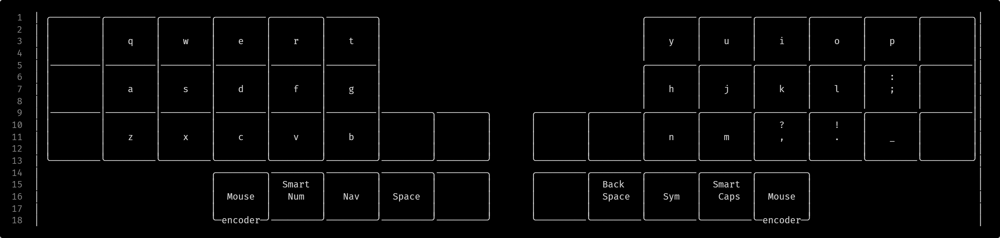
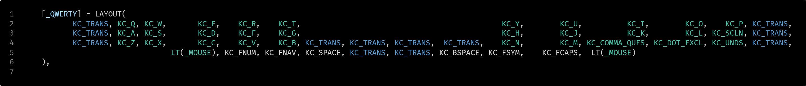

# generating keymap.c

This utility can generate a `keymap.c`, `layers.h` and `keymap.svg` file from visual layouts defined through `keymap.json` and `.layer` files (see examples\kyria\).
Please use a font that supports a good amount of unicode characters like `Fira Code`.

NOTE: The state of this utility is still 'Alpha', things might change and bugs might exist.

# example

from this:

to this:

